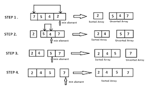

# Sorting 

## Selection Sort

<details>
  <summary>
<pre>
  <p align = "center">
    
  </p>
</pre>
  </summary>

  ```javascript
  TC : O ( N ^ 2 )

  function selectionSort(arr, n) {
    for (let i = 0; i < n - 1; i++) {
        let minIndex = i; 
        for (let j = i + 1; j < n; j++) {
            if (arr[j] < arr[minIndex]) {
                minIndex = j; 
            }
        }
        if (minIndex !== i) {
            [arr[i], arr[minIndex]] = [arr[minIndex], arr[i]];
        }
    }
    console.log(arr);
  }

  let arr = [13, 46, 24, 52, 20, 9];
  selectionSort(arr, arr.length);

```
</details>


